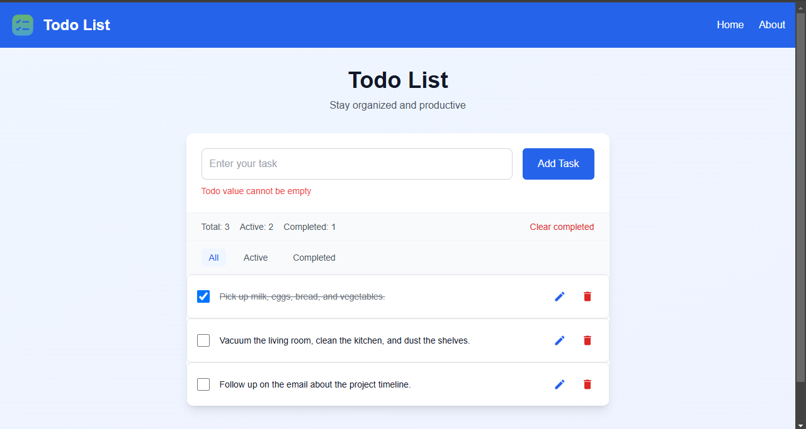

# Todo List Application 📝

A modern, intuitive Todo List application built with **Vue.js** and styled with **Tailwind CSS**. This application helps users manage their tasks efficiently with features like task creation, editing, filtering, and status tracking.

## Features ✨

- 📌 **Create Tasks**: Add new tasks with a title and optional description
- 🖊️ **Edit Tasks**: Update task details on the fly
- ✅ **Task Status**: Toggle tasks between complete and incomplete
- ❌ **Delete Tasks**: Remove unwanted tasks
- 🔍 **Filter Tasks**: View all, active, or completed tasks
- 📊 **Task Statistics**: Track your progress with task completion stats
- 🧹 **Bulk Actions**: Clear all completed tasks at once

## Tech Stack 🛠️

- **Vue**: Frontend framework for building user interfaces
- **Tailwind CSS**: Utility-first CSS framework for styling
- **Local Storage**: For persistent data storage


## Installation 🚀

1. Clone the repository:
   ```bash
   git clone https://github.com/lahiruanushka/vue-todo-list-app.git
   ```

2. Navigate to the project directory:
   ```bash
   cd vue-todo-list-app
   ```

3. Install dependencies:
   ```bash
   npm install
   ```

4. Start the development server:
   ```bash
   npm run dev
   ```

## Usage Guide 📖

### Creating a Task
1. Type your task in the input field
2. Press Enter or click the Add button
3. Your task will appear in the list

### Managing Tasks
- Click the checkbox to toggle the completion status
- Click the edit icon to modify task details
- Use the delete button to remove tasks
- Filter tasks using the All/Active/Completed buttons

### Task Statistics
The statistics bar shows:
- Total number of tasks
- Completed tasks count
- Active tasks remaining

## Features in Development 🚧

- 🔔 Task reminders and notifications
- 📱 Enhanced mobile responsiveness
- 🏷️ Task categories and tags
- 🔄 Data sync across devices
- 📝 Rich text formatting for task descriptions
  
## Screenshots 📸

### Home Page

*Central feed displaying recent todos*
